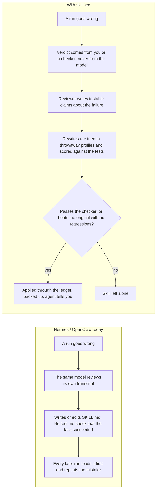
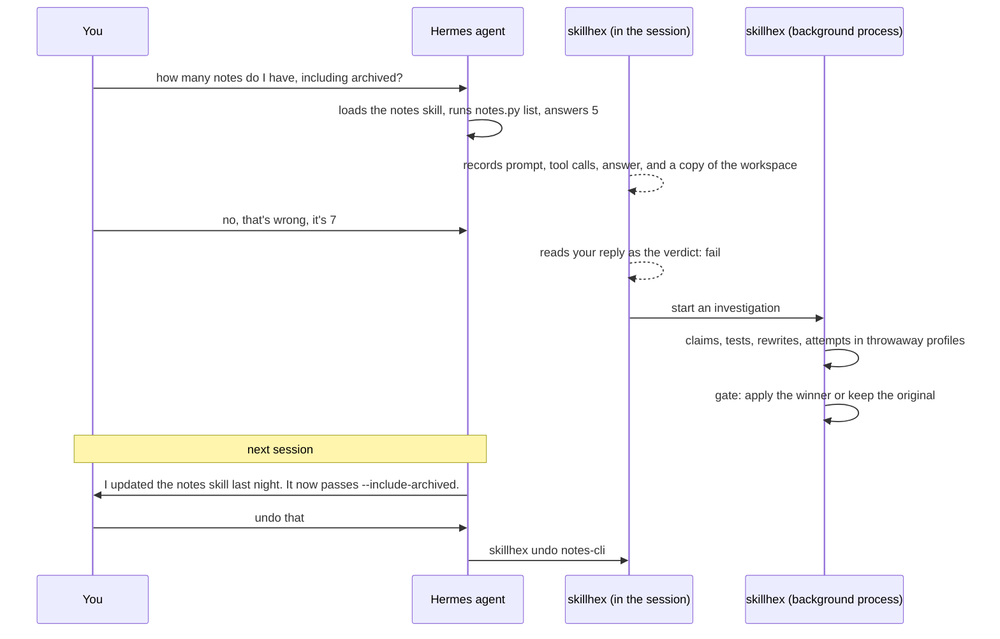
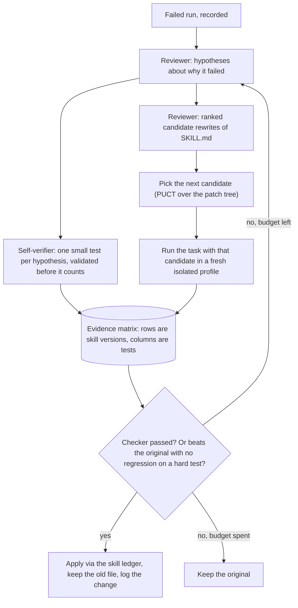

# skillhex

skillhex is a Hermes Agent plugin that fixes broken skills automatically, and proves the fix works
before it keeps it. It treats a skill like code: a change has to pass tests before it ships, and you
can always revert.

If you've watched Hermes or OpenClaw learn the wrong lesson from a failed run, you know why this
matters. skillhex takes the verdict from you or a checker, tests rewrites in throwaway profiles,
and keeps a rewrite only if it passes the checker or clearly beats the original without regressions.
Otherwise, it leaves the skill alone.

Once installed, it records skill-guided turns and investigates failures in a separate background
process. An investigation costs roughly 20k reviewer tokens plus up to `budget` short agent runs;
the default is 5 test attempts. It only happens after a failure. Set `auto_evolve` to false under
`plugins.entries.skillhex.settings` to turn off background investigations. To undo a change, use
`/skillhex undo <skill>` or ask the agent to revert it.

## Install

```bash
hermes plugins install zorrobyte/skillhex
hermes plugins enable skillhex
```

Add to `~/.hermes/config.yaml`:

```yaml
plugins:
  enabled: [skillhex]
skills:
  creation_nudge_interval: 0     # stop the built-in skill self-learning; memory review is untouched
```

`hermes plugins doctor skillhex` confirms it loaded.

You never get a prompt. If you have turned on Hermes's approval gate for skill writes
(`skills.write_approval: true`), skillhex stages its change for `/skills approve` instead of
applying it.

## Why test a skill before keeping it?

Hermes and OpenClaw both learn skills from experience: after a run, a background pass reads the
transcript and writes or edits a `SKILL.md`. That pass is done by the same model that just did the
task, it never checks whether the task actually succeeded, and it never tests what it wrote.

So when a run goes wrong, the skill learns the wrong thing. In a real OpenClaw log, the agent
misread a weather API and got a wrong forecast. The self-learning pass then wrote a weather skill
that bakes the misreading in. Every later weather question loads that skill first and repeats the
mistake. Nobody is told, and nothing catches it.

Here's where skillhex changes that process:



## What happens after a wrong answer

Say your notes skill wrongly says archived notes are included in `notes.py list`. You ask
"how many notes do I have, including archived?" The skill loads, the agent runs `notes.py list`,
and it answers 5. skillhex records your prompt, every tool call and result, the answer, and a copy
of the working directory from before the agent touched it.

You reply "no, that's wrong, it's 7." skillhex reads your next message as the verdict. The agent's
own opinion of its answer never counts. A checker script can play the same role.

In a separate background process, a reviewer model explains the failure as concrete claims, such
as "the skill never passes `--include-archived`". Each claim becomes a small Python test that reads
the recording and fails on the bad run.

Then skillhex rewrites the skill and runs the task again in a throwaway Hermes profile containing
nothing but that skill and a copy of your files. It scores every version against every test, tries
a few rewrites, and backs off a bad idea instead of spending the whole budget on it.

It keeps the rewrite only if it passes the checker, or clearly beats the original on the tests
without breaking anything the original got right. Otherwise the skill is left alone. The write
goes through Hermes's skill ledger, and the old version is kept for undo.

Next session, the agent knows what changed. "What did you change?" gets an explanation.
"Undo that" restores the old version. The tests stay with the skill and re-run the next time it's
used on a similar task. If they fail again and you say the answer was wrong, the change is rolled
back by itself.



## See what changed, or undo it

Start with `/skillhex` to see what has been captured, what failed, and what changed.
`/skillhex show <skill>` shows the diff of the last change and the run that made it;
`/skillhex undo <skill>` puts the previous version back.

The agent has a `skillhex` tool too, so you can just say "what did you change to the notes skill?"
or "revert that". It only undoes when you ask.

You can grade the last skill-guided answer yourself with `/skillhex ok` / `/skillhex fail <why>`.
Use `/skillhex runs`, `/skillhex evolve` to list runs or start one now.
For a browser view of the last run's diff, tests, and results, run `hermes skillhex report --open`.
From a shell, `hermes skillhex status`, `episodes`, `evolve`, and `undo --skill X` do the same.

## Choose your models

There are two jobs: the **executor** does the task, both live and again in each test run; the
**reviewer** diagnoses failures and writes tests and rewrites. Both are ordinary Hermes auxiliary
tasks. Pick them under `hermes model` → *Auxiliary models*, like the compression or vision model.

By default, one model does everything, with nothing to configure. That's still much safer than
what you have now: the reviewer has to state testable claims and is graded by running the tests
and by what you said, not by its own opinion.

The sweet spot is a cheap model acting and a strong model reviewing. Sonnet or a local model does
the volume; Opus or a frontier model is called only when a run failed. A local model acting with
any frontier model reviewing is where the plugin helps most: small models cannot diagnose their
own mistakes.

```yaml
auxiliary:
  skillhex_reflector:          # the reviewer (blank = main model)
    model: claude-opus-5
  skillhex_executor:           # the model that runs test attempts (blank = main model)
    model: qwen3-27b
    base_url: http://gpu:8000/v1
    provider: custom
```

## Adjust the defaults

Settings live under `plugins.entries.skillhex.settings` in config.yaml. Defaults are fine.

`auto_evolve` defaults to true and investigates failed runs in the background. `budget` defaults
to 5 test attempts per investigation. Without a checker, `min_score_to_apply` controls how
convincingly a rewrite must beat the original; its default is 0.8.

`auto_rollback` defaults to true: it reverts a change if its tests fail on reuse and you say the
answer was wrong. `bank_min_similarity` defaults to 0.5 and controls how similar a new task must
be before a skill's saved tests re-run. `classify_followups` defaults to true, using the model to
read your next message as ok/wrong; false = keywords only.

`snapshot_max_bytes` defaults to 50 MiB; above that size, skillhex skips copying the working
directory. `replay_mode` defaults to permissive: in test runs, web/browser tool results are replayed
from the recording; strict blocks unrecorded ones. `changes_window_days` defaults to 7 and controls
how far back the agent is told about changes.

## Does it work?

Unit tests: 138, no network. Live, on a deliberately poisoned notes skill (2026-09-21):

| setup | verdict came from | result |
|---|---|---|
| Muse acts and reviews, checker available | checker | fixed in 1 attempt, applied |
| Muse acts and reviews, no checker | my reply "no, that's wrong" | fixed in 1 attempt, applied; tests re-ran on the next use |
| Qwen3 27B (local) acts, Muse reviews | checker | fixed in 2 attempts, applied |

Before/after on five poisoned skills (CSV totals, log counting, semver bump, config units, notes),
each measured with real agent runs graded by a checker, once with Muse doing everything and once with
Qwen3 27B acting and Muse reviewing: mean pass rate went from 50% and 60% before to 100% after in both
runs, and every skill that was actually causing failures was repaired in two attempts. The two skills the
models ignored anyway were left alone at zero cost. Full tables and caveats in
[`eval/RESULTS.md`](eval/RESULTS.md); `eval/run_eval.py` reproduces it.

Honest limits. The gain is the gate more than the search: even one tested candidate beats writing
a skill from a failed transcript with no check. The paper's numbers come from benchmarks with
ground-truth checkers. Most real tasks have none, so the tests are model-written, and in
single-model mode the same model writes them. That is better than self-grading, not the same as
ground truth. Frontier models also sometimes ignore a bad skill and get the answer right anyway,
which limits what a rewrite can add.

## Under the hood

This is an implementation of [SkillHEX (Feng et al., 2026)](https://arxiv.org/abs/2608.05628),
"hypothesis-driven autonomous exploration and exploitation" for skills.

The paper calls the recording of one skill-guided turn (transcript, tool calls, files) an
*episode*. The reviewer maintains failure *hypotheses*: it can add, refine, refute, or drop a test
it distrusts. A *self-verifier* writes tests that print `SELF_VERIFIER_RESULT=PASS|FAIL`; they are
validated before they count.

The *evidence matrix* is versions × tests. A new test is replayed across cached attempts, and a
new version runs against all tests. Candidate rewrites form a *patch tree* searched with PUCT,
max-backup and first-play urgency (Appendix E, Algorithm 1), so a wrong first diagnosis cannot
consume the budget. Each attempt runs in a fresh, isolated Hermes profile against a copy of the
snapshotted workspace; web and browser tool results are replayed from the recording.



Here's a real matrix from the evaluation (config-units, Qwen executing, Muse reviewing):

| version | `t_ms_to_seconds_conversion` | official checker |
|---|---|---|
| v0 (original) | ✗ | fail |
| v1 (rewrite) | ✓ | pass |

The implementation makes some deliberate departures. The original skill is always a row in the
matrix, and a regression is only counted against what the original satisfied, so one bad test
cannot zero every candidate. Tests travel with the skill as a regression suite. Static lint
rejects malformed candidates before an attempt is spent. The verdict never comes from the
acting model.

If you're reading the source, `skillhex/` is the host-agnostic core (stdlib only). `__init__.py` +
`plugin.yaml` at the root are the Hermes plugin, and `skills/guide/` is a bundled skill that teaches
the agent to operate it. `fixtures/` and `eval/` are the test tasks; `tests/` is pytest.

MIT.
